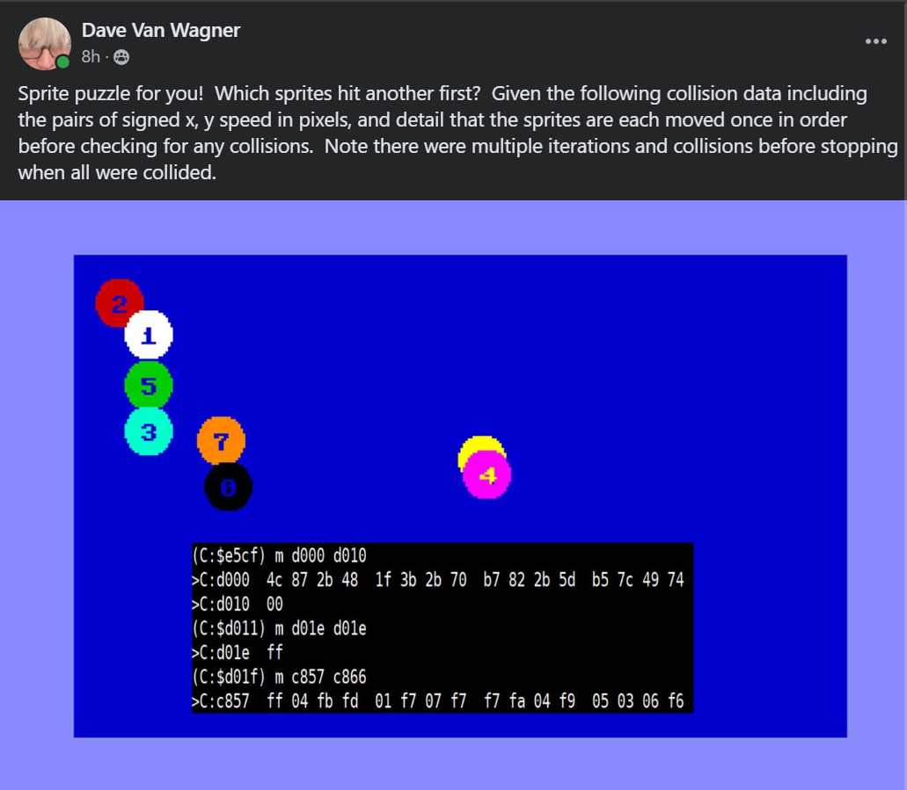

# dots64 puzzle #

Copyright (c) 2024 by David R. Van Wagner 
MIT LICENSE
davevw.com

10:25 PM 1/26/2024  Sprite puzzle for you!  Which sprites hit another first?

Given the following collision data including the pairs of signed x, y speed in pixels, and detail that the sprites are each moved once in order before checking for any collisions.

Answers when I figure it out, ~24 hours

note: circles are radius 10, sin/cos math truncated to int sprite data for a solid circle: 

```
00 00 00 00 ff 00 03 ff c0 07 ff e0 0f ff f0 0f 
ff f0 1f ff f8 1f ff f8 3f ff fc 3f ff fc 3f ff 
fc 3f ff fc 3f ff fc 3f ff fc 1f ff f8 1f ff f8 
0f ff f0 0f ff f0 07 ff e0 03 ff c0 00 ff 00
```

Also I didn't stop processing until there were 7 or more collisions... so may have to back up the movement a few iterations or more to find each first collision.  So hint: backup 3 iterations with subtraction.

10:13 AM 1/27/2024 Instructions for DOTS64.D64

```
POKE 44,10:POKE 2560,0:NEW
LOAD"DOTS64LOADER",8
RUN
```

-OR-
```
LOAD"DOTS64.ML",8,1
POKE 44,10:POKE 2560,0:NEW
SYS 49152
```

Wait, sprites will load, then display on screen, data in memory will match picture.   Do ``SYS49152`` to restore sprites if needed.

