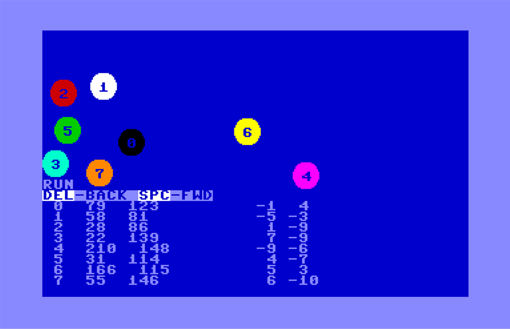

# dots64 puzzle #

Copyright (c) 2024 by David R. Van Wagner 
MIT LICENSE
davevw.com

10:25 PM 1/26/2024  Sprite puzzle for you!  Which sprites hit another first?

Given the following collision data including the pairs of signed x, y speed in pixels, and detail that the sprites are each moved once in order before checking for any collisions.

Answers when I figure it out, ~24 hours

note: circles are radius 10, sin/cos math truncated to int sprite data for a solid circle: 

```
00 00 00 00 ff 00 03 ff c0 07 ff e0 0f ff f0 0f 
ff f0 1f ff f8 1f ff f8 3f ff fc 3f ff fc 3f ff 
fc 3f ff fc 3f ff fc 3f ff fc 1f ff f8 1f ff f8 
0f ff f0 0f ff f0 07 ff e0 03 ff c0 00 ff 00
```

Also I didn't stop processing until there were 7 or more collisions... so may have to back up the movement a few iterations or more to find each first collision.  So hint: backup 3 iterations with subtraction.

10:13 AM 1/27/2024 Instructions for DOTS64.D64

```
LOAD"RUNME",8
RUN
```

-OR-
```
LOAD"DOTS64.ML",8,1
POKE 44,10:POKE 2560,0:NEW
LOAD"DOTS64STEPS",8
RUN
```

1. Wait, sprites and solver will load, screen will resemble puzzle.   Do ``SYS49152`` to restore sprites if needed.


2. Tap the DELETE/BACKSPACE key three times, and will backup time to non-colided state, with sprite 3 at the left edge of the screen.
3. Tap SPACEBAR slowly to advance the sprites forward in time based on their speeds (distances per iteration).   
4. You will observe the sprite numbers and coordinates on the left of the screen, with the speeds on the right of the screen.  
5. And as they move, the closest sprites data will show in the center of the screen including distance in pixels.  
6. Any detected collisions will be shown in inverse.
7. Collision bitmask after all sprites are iterated will be shown in reverse on the left.
8. Repeat SPACEBAR to advance forward in time until all are collided as shown in the puzzle.
9. Move back, and repeat forward in time watching slowly to see which sprites hit the other sprites.  You can solve by observation.
10. Note: alternatively you could've solved with a spreadsheet to crunch the numbers backwards and forwards.

The distance between sprites is calculated using the [Pythagorean theorem](https://en.wikipedia.org/wiki/Pythagorean_theorem).  Since these are circles of radius 10, if the distance is 20 or less, they are considered touching, and because they are identically shaped circles it doesn't matter whether you measure the distinces of the sprite origins, or take an extra step and calculate the center of the circles -- the symmetry cancels out the need for the extra step.  While that BASIC processing is going on, the Commodore 64 [VIC-II](https://en.wikipedia.org/wiki/MOS_Technology_VIC-II) chip that is painting the sprites on screen is also detecting collisions as it runs through the scan lines, with that data displayed as well.



Answer will also be posted on [X/Twitter](https://twitter.com/DaveRVW/status/1751494328688742602).
